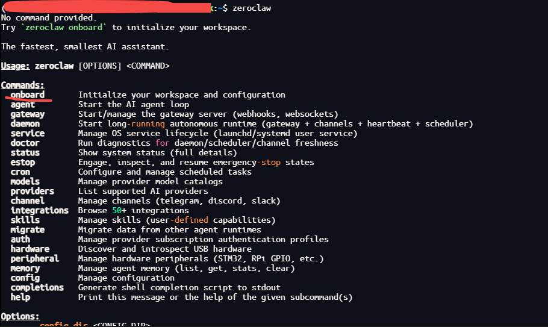
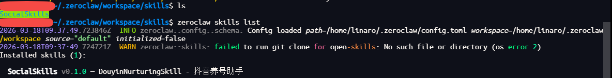
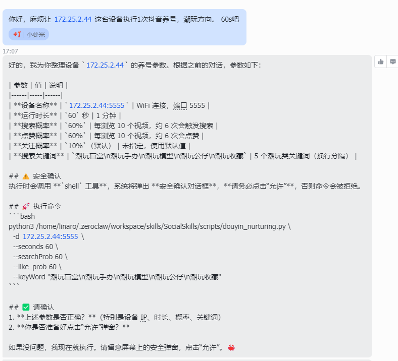
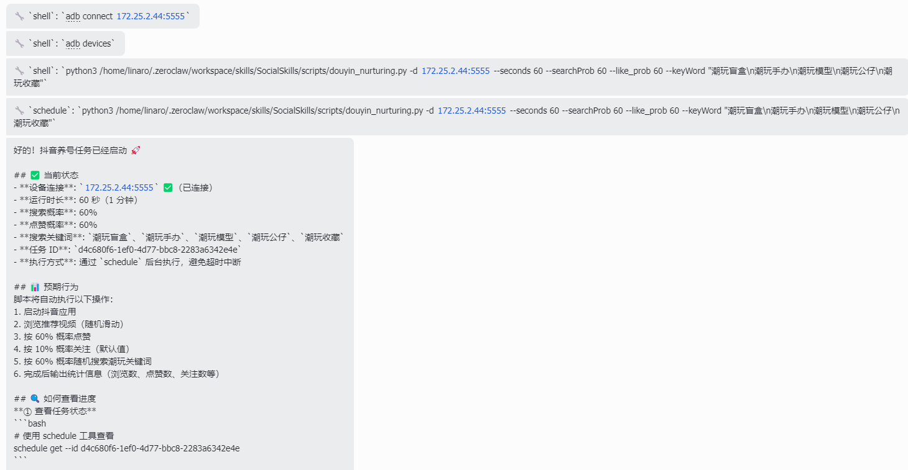

# 我用OpenClaw跑手机自动化脚本


# 需要什么？
- 只要一个树莓派
- 手机跟树莓派在同一个网络环境

# 安装ZreoClaw

## 准备工作
### 准备飞书应用
这里只是简要写一下，进入[开发者后台](https://open.feishu.cn/app)，新建应用，添加机器人，拿到appid、和appsercart即可

详细参考这篇文章的[飞书配置部分](https://mp.weixin.qq.com/s/vKA-Q4sOROg0mhol83Y1oQ?scene=1&click_id=3)

注意要先启动ZeroClaw，再去设置文章中提到的（订阅方式：长连接）

### liunx下安装adb 及python 环境

## 安装

### 前提需要安装rust 编译工具cargo

```
sudo apt update
sudo apt install rustc cargo
```
### clone、编译、安装

[ZreoClaw]()
建议使用本地编译，这样可以支持所有设备

```
# Clone and build
git clone https://github.com/zeroclaw-labs/zeroclaw.git
cd zeroclaw
cargo build --release --locked
cargo install --path . --force --locked

# Ensure ~/.cargo/bin is in PATH
export PATH="$HOME/.cargo/bin:$PATH"
```
###  初始化

指定onboard命令即可



# 配置ZreoClaw 

## shell命令权限

参考文档：[ZreoClaw配置参考](https://github.com/zeroclaw-labs/zeroclaw/blob/master/docs/i18n/zh-CN/reference/api/config-reference.zh-CN.md)

```
vim ~/.zeroclaw/config.toml
```


# 接入Skills

将当前项目放入到~/.ZreoClaw/workspace/skills/ 目录下面

使用 ZreoClaw skills list 检查是否没有问题



SKill 除了核心内容，其余的都不要保留

SocialSkills/                  # 技能根目录
├── scripts/
│   └── douyin_nurturing.py    # 养号脚本
├── SKILL.md                   # 本技能文档
├── README.md                  # 项目说明
└── requirements.txt           # Python 依赖

# 飞书聊天记录

录屏是加速了的请看顶部


